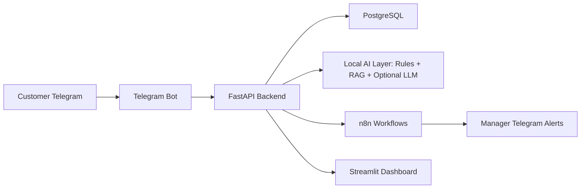

# E-commerce Support Automation

Production-style Applied AI MVP for automating customer support at a fictional consumer electronics store, TechGear Store.

## Business Value

The system reduces repetitive support work while keeping risky customer cases under human review.

## Architecture



## Quick Start

```bash
cp .env.example .env
docker compose up --build
```

Then open:

- Backend docs: http://localhost:8000/docs
- Dashboard: http://localhost:8501
- n8n: http://localhost:5678

Seed data:

```bash
make seed
```

Run demo messages without Telegram:

```bash
make demo
```

## AI Engineering Approach

This is not an OpenAI wrapper. The backend combines deterministic support rules, local intent classification, local retrieval over FAQ/policies, guardrails, human-in-the-loop ticketing, AI observability, and optional LLM drafting.

## Current Status

This repository is initialized as a staged MVP. See `docs/` for detailed setup, architecture, security, and demo instructions once implementation is complete.
