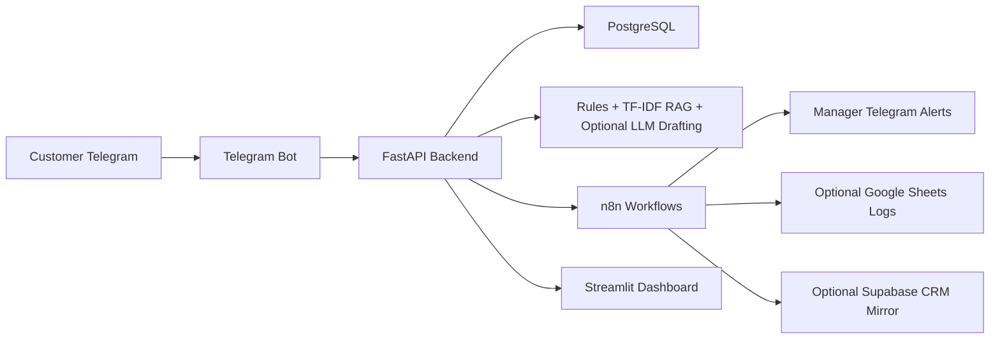
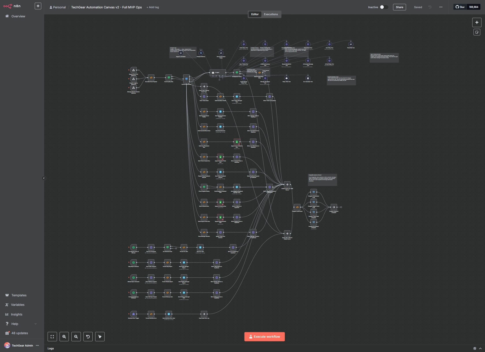

# E-commerce Support Automation

Applied AI support automation MVP for a fictional electronics shop, **TechGear Store**.

This project is my take on a realistic internal support automation system for a small e-commerce team. It is not meant to pretend to be an enterprise SaaS. It is a production-style MVP: Dockerized, testable, observable enough for a portfolio demo, and designed around the kind of support work a small store actually has every day.

## What Problem It Solves

Small stores spend a lot of time answering the same Telegram messages:

- Where is my order?
- How long does delivery take?
- Can I return this?
- Is this product in stock?
- I received a damaged item.
- I want a human manager.

The risky part is not only response speed. It is also making sure the bot does **not** invent a tracking number, promise a refund, guess stock, or ignore an angry customer. This MVP is built around that principle: when the system is uncertain, it creates a ticket instead of guessing.

## What The MVP Does

- Receives customer messages through a Telegram bot.
- Sends all natural-language messages to a FastAPI backend.
- Classifies intent with deterministic rules plus an optional sklearn baseline.
- Uses local RAG over English/Russian FAQ and policy documents.
- Looks up order status in PostgreSQL.
- Searches a seeded product catalog for stock and alternatives.
- Creates support tickets for risky, unknown, or low-confidence cases.
- Escalates complaints and human-agent requests to a manager workflow.
- Tracks SLA deadlines and exposes SLA breach data.
- Emits events to n8n for escalation, reporting, logging, feedback, and CRM-style sync.
- Shows business and AI metrics in a Streamlit dashboard.
- Works locally without Telegram, OpenAI, Google, or Supabase credentials.
- Supports optional OpenAI drafting, but does not require it.

## Architecture



The backend is the source of truth. The bot, dashboard, and n8n workflows call backend APIs instead of duplicating business logic.

## Tech Stack

- **Backend:** FastAPI, SQLAlchemy 2, Pydantic Settings
- **Database:** PostgreSQL
- **Bot:** aiogram, long polling for local development
- **AI/ML:** deterministic rules, sklearn TF-IDF/LogisticRegression baseline, local TF-IDF RAG, optional OpenAI provider
- **Automation:** self-hosted n8n
- **Dashboard:** Streamlit
- **Testing:** pytest, ruff, synthetic MVP audit
- **Runtime:** Docker Compose

## Quick Start

```bash
cp .env.example .env
docker compose up --build
```

Local URLs:

- Backend docs: http://localhost:8000/docs
- Dashboard: http://localhost:8501
- n8n: http://localhost:5678

Seed the database:

```bash
docker compose exec backend python scripts/seed_db.py
```

Run a no-Telegram demo:

```bash
docker compose exec backend python scripts/demo_conversation.py
```

Run the synthetic MVP audit:

```bash
python scripts/synthetic_mvp_audit.py
```

If you have `make` installed, the same common commands are also available as `make seed`, `make demo`, `make test`, `make lint`, `make evaluate`, and `make synthetic`.

## Environment Variables

Copy `.env.example` to `.env`. The default values are local placeholders.

The project intentionally runs without real external credentials:

- no Telegram token required for backend/dashboard/demo;
- no OpenAI key required;
- no Google credentials required;
- no Supabase credentials required;
- no real n8n credentials committed.

The Telegram bot enters mock/sleep mode when `TELEGRAM_BOT_TOKEN` is empty.

## Telegram Bot

The bot is only an interface layer. It handles `/start`, `/help`, `/order`, `/ticket`, `/faq`, and admin commands, but it does not decide business outcomes. Customer messages are forwarded to `/support/message`, and the backend returns the intent, confidence, reply, ticket status, escalation status, retrieved sources, and guardrail result.

Admin commands are protected by `MANAGER_CHAT_IDS`.

## n8n Automation

Import workflows from `n8n/workflows/`.

For portfolio review, import:

```text
techgear_automation_canvas_v2_workflow.json
```

That is the large connected MVP canvas. It includes:

- support intake webhooks;
- central event routing;
- AI Agent with chat model placeholder, Postgres Chat Memory, structured output parser, backend HTTP tools, Code Tool, Think Tool, and Calculator Tool;
- escalation branches;
- manager-review branches;
- SLA monitor;
- daily and weekly reports;
- feedback handling;
- Google Sheets logging branch;
- optional Supabase CRM mirror;
- PostgreSQL audit snapshots;
- error handler and dead-letter path.

External n8n credentials are placeholders. Replace them in the n8n UI only when you want to connect real Telegram, Google Sheets, Supabase, PostgreSQL memory, or an optional LLM.

## Configured n8n MVP Canvas

This screenshot shows the main connected n8n editor canvas. The AI agent tools are separated into readable lanes, and the rest of the workflow shows the business automation around it.



## Demo Scenarios

Good messages to try:

- `Where is my order 10042?`
- `Где мой заказ 10042?`
- `Has my order been shipped?`
- `Where is my order 99999?`
- `How long does delivery take?`
- `Сколько идет доставка?`
- `Do you have iPhone 15 case?`
- `I need a refund`
- `My order arrived broken`
- `Позовите оператора`
- `asdfghjkl`

Expected behavior:

- known order IDs are answered from the database;
- missing order IDs trigger a clarification request;
- unknown orders create tickets;
- FAQ answers come from local retrieval;
- product stock comes from the catalog;
- complaints and human-manager requests escalate;
- refund requests do not receive automatic refund promises;
- unknown/low-confidence messages fall back to human review.

## API Docs

Run the backend and open `/docs`.

Main endpoints:

- `POST /support/message`
- `GET /orders/{order_id}`
- `GET /products/search?q=`
- `POST /knowledge/answer`
- `GET /tickets`
- `GET /tickets/open`
- `GET /tickets/sla-breaches`
- `POST /tickets/{ticket_id}/resolve`
- `GET /analytics/*`
- `POST /ai/evaluate-message`
- `POST /ai/draft-reply`
- `GET /ai/metrics`

Admin endpoints use `X-Admin-API-Key`. This is MVP-level protection, not full production auth.

## AI Engineering Approach

This project is deliberately not an OpenAI wrapper.

The AI design is layered:

1. Deterministic rules catch high-precision cases like order status, complaints, refunds, human-agent requests, spam, urgent words, and order IDs.
2. Local retrieval finds grounded FAQ/policy answers from markdown knowledge files stored in the database.
3. Confidence thresholds decide whether the system may answer or must create a ticket.
4. Guardrails block risky responses.
5. Optional LLM drafting can make wording nicer, but only from verified context.
6. Human-in-the-loop handles complaints, refund risk, unknown intent, low confidence, and customer requests for a manager.

The key rule is simple: uncertainty becomes a ticket, not a hallucinated answer.

## ML And Classification

The default runtime uses deterministic rules because they are easier to trust for business-critical routing. A lightweight sklearn TF-IDF + LogisticRegression classifier is included for experimentation:

```bash
python scripts/train_intent_classifier.py
python scripts/evaluate_classifier.py
```

The sample dataset is intentionally imperfect and imbalanced, like early real support data often is. The point is to show the pipeline and limitations honestly, not to claim a perfect classifier.

## RAG And Knowledge Retrieval

The knowledge base is built from local English and Russian markdown files:

- FAQ
- delivery policy
- returns/refunds policy
- warranty policy
- damaged item instructions
- human support policy

Documents are chunked into `knowledge_articles`. Retrieval uses local TF-IDF-style scoring plus domain keyword boosts. If retrieval confidence is too low, the backend creates a ticket instead of answering confidently.

## Guardrails And Human Review

The assistant must not:

- invent order status;
- invent tracking numbers;
- invent product stock;
- promise refunds;
- make legal claims;
- expose internal prompts or notes;
- answer outside store policy;
- ignore a request for a human manager.

High-risk cases produce tickets and manager review.

## Evaluation And Synthetic Audit

Run:

```bash
pytest backend/tests bot/tests -q
ruff check backend bot dashboard scripts
python scripts/evaluate_classifier.py
docker compose exec backend python scripts/evaluate_ai_system.py
python scripts/synthetic_mvp_audit.py
```

The synthetic audit calls the running backend and checks:

- order status flow;
- missing and nonexistent order handling;
- FAQ retrieval;
- product availability;
- complaint escalation;
- refund safety;
- human-manager request;
- unknown fallback;
- backend endpoints used by n8n AI tools;
- n8n AI Agent wiring;
- Postgres memory/audit nodes;
- approximate layout overlap in the AI tool area.

## Dashboard

The Streamlit dashboard shows:

- total messages;
- auto-resolved messages;
- created/open tickets;
- complaints;
- SLA breaches;
- intent distribution;
- open ticket table;
- recent escalations;
- AI metrics;
- human-review and auto-resolution rates.

It calls the backend API rather than reading the database directly.

## Security Notes

No real secrets are committed. `.env` is ignored.

The repository includes only placeholder credential names for Telegram, OpenAI, Google Sheets, Supabase, PostgreSQL memory, and n8n. Real credentials should be added manually by the project owner in local `.env` files or the n8n UI.

For real production use, this would need stronger auth, signed webhooks, secret management, rate limiting, audit log hardening, network restrictions, backups, and monitoring.

## Limitations

This is a deployable internal MVP foundation, not a fully production-ready SaaS.

Current limitations:

- SQLAlchemy `create_all` instead of Alembic migrations;
- MVP admin key instead of proper RBAC/OAuth;
- local TF-IDF retrieval instead of a production vector search stack;
- optional LLM and external integrations are placeholders by default;
- classifier quality is baseline-level and should improve with real feedback data;
- n8n AI Agent is configured for orchestration/demo and should not replace backend policy decisions.

## Roadmap

- Add Alembic migrations.
- Add production auth/RBAC.
- Add signed webhook verification.
- Add richer manager UI.
- Add queue-based retries for event delivery.
- Improve multilingual classifier evaluation.
- Add production tracing and dashboards.
- Use stored human feedback for model and prompt iteration.

## Commercial Use Case

Target users are small e-commerce teams that spend too much time on repetitive support and do not want angry or urgent cases to disappear in a chat queue.

The MVP can automate safe answers, speed up order/product checks, escalate complaints, track SLA, and produce manager reports while keeping humans in control of risky decisions.

## Folder Structure

```text
backend/     FastAPI, database, AI layer, services, tests
bot/         Telegram bot interface
dashboard/   Streamlit operations dashboard
n8n/         Importable automation workflows
data/        Seed, evaluation, and training data
scripts/     Seed, train, evaluate, demo, synthetic audit scripts
docs/        Architecture, AI, setup, security, roadmap
```
