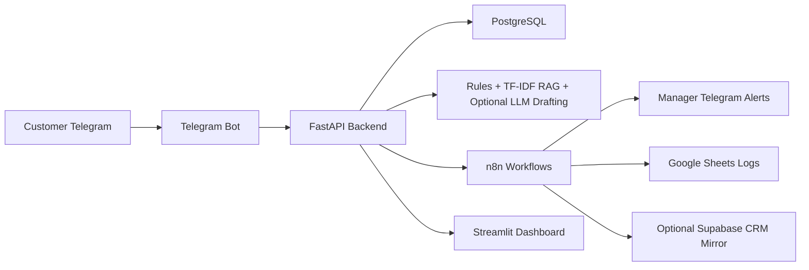
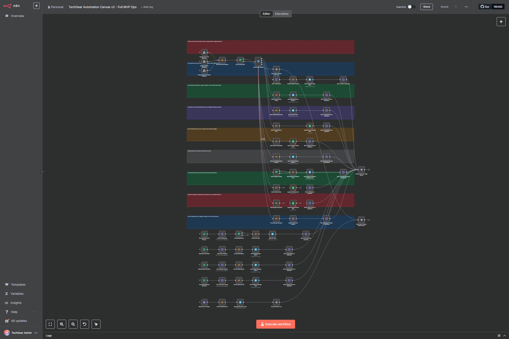

# E-commerce Support Automation

Production-style Applied AI MVP for automating customer support at a fictional small electronics store, **TechGear Store**.

## One-Sentence Business Value

The platform answers repetitive e-commerce questions quickly while routing risky, low-confidence, or emotional cases to a human manager with SLA tracking.

## Problem Statement

Small stores often answer the same Telegram support questions manually: order status, delivery timing, payment, warranty, returns, and stock. Complaints can be missed, SLA ownership is unclear, and managers lack a simple view of AI quality. This MVP demonstrates an internal automation foundation that combines deterministic business rules, local RAG, optional LLM drafting, ticketing, n8n automation, and human review.

## MVP Features

- Telegram bot for customer and manager commands.
- FastAPI backend with PostgreSQL persistence.
- Local intent classification using rules plus optional sklearn TF-IDF classifier.
- Local RAG over English/Russian FAQ and policy markdown.
- Order lookup and product catalog search from seeded data.
- Guardrails that prevent invented order status, stock, refunds, legal claims, and ungrounded answers.
- Ticketing, escalation, SLA breach monitoring, and feedback storage.
- n8n workflows for escalation, reports, SLA checks, feedback, Google Sheets logging, Supabase CRM mirroring, and error handling.
- Streamlit dashboard for business and AI metrics.
- Optional OpenAI provider for drafting only; local/mock mode is default.
- Tests, CI, seed data, evaluation scripts, and Docker Compose.

## Architecture



## Tech Stack

FastAPI, SQLAlchemy 2, PostgreSQL, Pydantic Settings, aiogram, Streamlit, scikit-learn, n8n, optional Google Sheets/Supabase integrations, Docker Compose, pytest, ruff, GitHub Actions.

## Quick Start

```bash
cp .env.example .env
docker compose up --build
```

Local URLs:

- Backend docs: http://localhost:8000/docs
- Dashboard: http://localhost:8501
- n8n: http://localhost:5678

Seed the database:

```bash
make seed
```

Run the local demo without Telegram:

```bash
make demo
```

## Environment Variables

Copy `.env.example` to `.env` and change only local placeholders. Real Telegram, OpenAI, Google, Supabase, and n8n credentials are never committed. Backend works without Telegram, OpenAI, Google, or Supabase credentials. Bot enters documented mock/sleep mode when `TELEGRAM_BOT_TOKEN` is empty.

## Telegram Bot Setup

Create a bot token manually in Telegram, set `TELEGRAM_BOT_TOKEN`, and optionally set comma-separated `MANAGER_CHAT_IDS`. Admin commands require the chat ID to be listed. The bot uses long polling for local development and calls backend APIs instead of duplicating support logic.

## n8n Setup

Import workflows from `n8n/workflows/`. For portfolio review, import `techgear_automation_canvas_v2_workflow.json`; it is the large connected MVP canvas. Replace placeholder credential names in the n8n UI when enabling real Telegram, Google Sheets, or Supabase integrations. Backend webhook env vars point to Docker network URLs such as `http://n8n:5678/webhook/support-event-hub`.

## Configured n8n MVP Canvas v2

The screenshot below shows the configured n8n editor canvas for the MVP. Backend webhooks, AI decision routing, ticket operations, SLA jobs, feedback handling, Telegram manager alerts, Google Sheets logging, Supabase CRM mirror branches, and error handling are connected in one support automation workflow.



## Demo Scenarios

Try:

- `Where is my order 10042?`
- `Где мой заказ 10042?`
- `How long does delivery take?`
- `Do you have iPhone 15 case?`
- `I need a refund`
- `My order arrived broken`
- `Позовите оператора`
- `asdfghjkl`

## API Docs

Run the backend and open `/docs`. Main endpoints include `/support/message`, `/orders/{order_id}`, `/products/search`, `/knowledge/answer`, `/tickets`, `/tickets/sla-breaches`, `/analytics/*`, and `/ai/*`.

## AI Engineering Approach

This is not just a chatbot or OpenAI wrapper. Critical decisions are controlled by deterministic rules, database lookups, confidence thresholds, retrieval grounding, guardrails, and human review. The optional LLM provider drafts wording only from verified context and is never the sole decision-maker for refunds, escalation, product stock, order status, or SLA.

## ML / Classification Approach

The default classifier uses high-precision rules for order status, complaints, returns, human-agent requests, spam, urgent language, and order ID extraction. A trainable sklearn TF-IDF + LogisticRegression baseline is included for experimentation:

```bash
make train
python scripts/evaluate_classifier.py
```

## RAG / Knowledge Retrieval

FAQ and policy markdown files are chunked into `knowledge_articles`. Retrieval uses local TF-IDF plus domain keyword boosts for FAQ sections. Low retrieval confidence creates a ticket instead of hallucinating.

## Guardrails And Human-In-The-Loop

Auto-reply is allowed only for high confidence, grounded, low-risk cases. Complaints, human requests, refund risk, missing order/product data, unknown intent, and low confidence create tickets with suggested replies. Manager edits and final replies can be stored for future model improvement.

## Evaluation Metrics

Run:

```bash
make evaluate
```

The AI evaluation reports intent accuracy, escalation precision/recall, auto-resolution accuracy, fallback accuracy, retrieval hit rate, and unsafe auto-replies prevented.

## Dashboard

The Streamlit dashboard shows overview metrics, open tickets, SLA breaches, intent distribution, ticket detail, recent AI metrics, human-review rate, auto-resolution rate, and unsafe answer prevention count.

## Security Notes

No real secrets are committed. `.env` is ignored. Admin endpoints use `X-Admin-API-Key`, which is MVP-level protection only. n8n workflows use placeholder credential names and environment variable references for Telegram, Google Sheets, and Supabase. Production would need proper auth, webhook signing, rate limiting, audit logging, secret management, and stricter network controls.

## Limitations

This is a production-style MVP and deployable internal prototype, not enterprise SaaS. It uses simple SQLAlchemy schema creation, local retrieval, MVP auth, and mock credentials by default.

## Roadmap

Add migrations, real auth, signed webhooks, richer manager UI, production observability, better multilingual classifier evaluation, and feedback-driven model iteration.

## Commercial Use Case

Target customer: small e-commerce stores with repetitive support and limited manager time. The MVP automates safe answers, highlights urgent complaints, tracks SLA, and produces reports while preserving human control over risky decisions.

## Folder Structure

```text
backend/     FastAPI, database, AI layer, services, tests
bot/         Telegram bot interface
dashboard/   Streamlit operations dashboard
n8n/         Importable automation workflows
data/        Seed, evaluation, and training data
scripts/     Seed, train, evaluate, demo scripts
docs/        Architecture, AI, setup, security, roadmap
```
