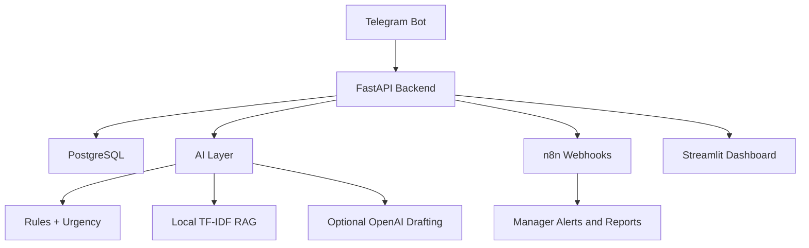

# Architecture

TechGear Store support automation uses a hub-and-spoke design centered on the FastAPI backend.

The backend owns all business decisions. The bot and dashboard are interface layers. n8n is used for operational workflows: alerts, scheduled reports, SLA checks, feedback requests, and CRM-style logging.

Data is stored in PostgreSQL in Docker. Local development can use SQLite through `DATABASE_URL` when running scripts/tests outside Docker.
